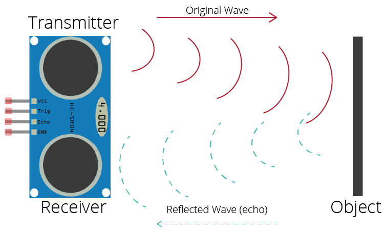

## Input Team
In this team we are going to make a sensor to measure the height from the sensor till the hand/object
for this we use a Ultrasonic sensor

## Sensor Requirements:
Ultrasonic sensor
## Summary Ultrasoon Hardware
it is a pretty simple concept it will pusle a sound (ultrasonic) and try to receive the signal back, time between send and receive is the distance. 

distance to an object = ((speed of sound in the air(343.2 m/s))*time)/2
pinout:
- vcc-> + (5v or 3.3v)
- trig -> is the trigger to transmit the signal (`high` is sending wave, `low` is stop sending wave)
- Echo -> is the input pin, that will go from `low` to `high` when it receives somthing
- GND -> Ground

## Summary Of Steps Ultrasoon Sensor:
- Setup all pins and be able to send a sound wave (10ms or so)
- Setup a timer that will start when you start stransmitting and stop when you pin go to high see: (time pulse)[https://docs.micropython.org/en/latest/library/machine.html#machine.time_pulse_us]
- calculate the distance and return it (check if you have a `time out`, for wrong distances)
